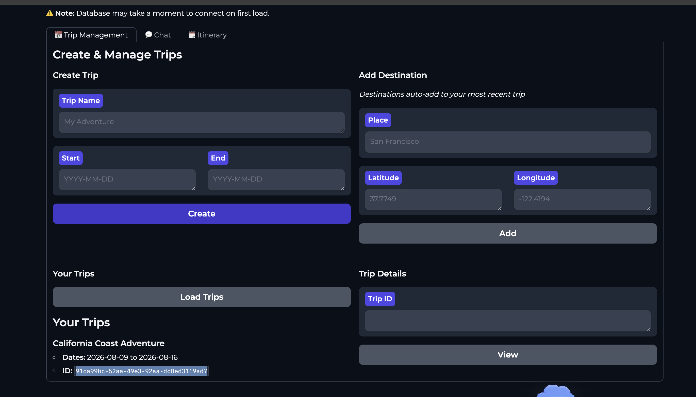

# Weather Intelligence Trip Planner

A Databricks App for creating users and trips, enriching destinations with live weather and activity data, and generating weather-aware itineraries with a Databricks-hosted Llama model.

Final project submission for the Zach Wilson Databricks AI Engineering Bootcamp.

**Live app:** [Open Weather Intelligence Trip Planner](https://weatherintelligenceaiapp-1948627471165119.aws.databricksapps.com)  
**Repository:** [github.com/shashidharsd5046/trip-planner-app](https://github.com/shashidharsd5046/trip-planner-app)




## Features

- Create users with generated Lakebase UUIDs.
- Create trips associated with a user.
- Create a trip together with its first destination.
- Add additional destinations.
- Query trips by user ID.
- Generate itineraries with the AI agent.
- Use weather tools to evaluate and reschedule activities.
- Build packing lists.
- View itinerary and packing-list data.
- Use Databricks Genie and semantic activity search through registered tools.

## Architecture

```text
User creates user/trip/destination in Gradio
                 │
                 ▼
Lakebase (Postgres + pgvector)
                 │
                 ├── Open-Meteo weather and air-quality enrichment
                 ├── Wikimedia activity/attraction enrichment
                 ├── Activity documents and embeddings
                 └── Semantic retrieval for itinerary generation
                              │
                              ▼
Databricks Model Serving (Llama 3.3 70B) + agent tools
                              │
                              ▼
Itinerary, rescheduling, packing list, and explanations
```

The ingestion path is destination-driven: after a destination is added, the app fetches weather, seeds activities, creates activity documents, and writes embeddings. The agent then retrieves trip context and suitable activities before generating the itinerary.

## Project structure

```text
trip-planner-app/
├── app.py                         # Gradio web application
├── agent.py                       # Tool-enabled AI agent
├── simple_agent.py                # Lightweight fallback agent
├── api_client.py                  # Open-Meteo and Wikimedia clients
├── data_ingestion.py              # Destination enrichment and embedding ingestion
├── embedding_service.py           # Embedding generation and pgvector persistence
├── app.yaml                       # Databricks Apps start configuration
├── requirements.txt               # Python dependencies
├── capabilities/                  # Higher-level itinerary capabilities
├── tools/                         # AI-callable weather, query, and Lakebase tools
└── utils/
    ├── database.py                # UI database operations
    └── agent_interface.py         # Chat-to-agent bridge
```

## Databricks deployment

The app is configured to run on port `8080` locally, while Databricks Apps supplies the runtime host and port through environment variables.

`app.yaml` starts the app with:

```yaml
command:
  - "python"
  - "app.py"
```

Deploy the project directory as a Databricks App. The app needs:

1. A Lakebase/Postgres resource or valid Lakebase connection credentials.
2. A model-serving endpoint resource with **Can query** permission.
3. Permission to use any Genie space or other Databricks resources used by the tools.

Databricks Apps provides service-principal authentication. The AI agent uses the Databricks SDK OAuth configuration and falls back to `DATABRICKS_TOKEN`, `SP_ACCESS_TOKEN`, or `GRPC_GATEWAY_TOKEN` when available.

## Lakebase tables

The UI expects at least these relationships:

```text
users(user_id, display_name, home_latitude, home_longitude, created_at)
  └── trips(user_id, trip_id, trip_name, start_date, end_date, created_at)
        └── destinations(trip_id, destination_id, place_name, latitude, longitude)
```

User and trip IDs should be UUIDs generated by Lakebase defaults or by the application. Trips must reference an existing user ID.

The complete context-engineering schema includes:

`users`, `trips`, `destinations`, `activities`, `itinerary_items`, `weather_snapshots`, `packing_items`, `activity_documents`, `activity_embeddings`, and `user_preferences`.

The UI workflow is:

1. Create a user.
2. Copy or retain the displayed generated user ID internally.
3. Create a trip and first destination.
4. Load trips by user ID.

## Local development

Use Python 3.11 or newer.

```bash
python3 -m venv .venv
source .venv/bin/activate
pip install -r requirements.txt
python app.py
```

The local app runs at `http://127.0.0.1:8080` or the address printed by Gradio.

## Configuration

Do not commit passwords, personal access tokens, or client secrets. Configure secrets through Databricks App environment variables or secret-backed resources.

Common variables include:

```text
DATABRICKS_HOST
DATABRICKS_CLIENT_ID
DATABRICKS_CLIENT_SECRET
LAKEBASE_PASSWORD
GRADIO_SERVER_NAME
GRADIO_SERVER_PORT
```

The Databricks runtime normally supplies the Gradio host and port automatically.

## AI tools

The full agent in `agent.py` exposes tools for:

- Generating day-by-day itineraries.
- Checking live weather.
- Rescheduling activities for bad weather.
- Building packing lists.
- Adding, removing, and moving activities.
- Querying trips and destinations.
- Searching activities semantically.
- Explaining weather-related changes.

The chat interface uses `utils/agent_interface.py`, which calls the full tool-enabled agent and displays tool results in the conversation.

## Vector-search architecture

The project now follows the Lakebase context-engineering pattern used in the referenced Lakebase app-day repository: credentials are supplied as one secret-backed `LAKEBASE_URL`, source documents are stored in Lakebase, embeddings are persisted in a pgvector column, and retrieval happens before itinerary generation.

Run `sql/01_setup_activity_embeddings.sql` in the Lakebase SQL editor, then use `scripts/seed_activity_embeddings.py` or the ingestion path to populate `activity_documents` and `activity_embeddings`. `sql/02_activity_similarity_query.sql` is the retrieval query used by the application layer. Keep the embedding dimension consistent with the embedding model.

Run `sql/03_setup_preferences.sql` to persist user interests and free-form planning notes. The itinerary generator automatically includes this context when the table exists.

## Jobs and data flow

The Databricks jobs are complementary: the UC sync job copies Lakebase data into Unity Catalog on its schedule; the refresh job handles scheduled enrichment; and the embedding job backfills semantic activity data. Interactive destination creation also runs the enrichment path immediately, so the app does not depend on waiting for a scheduled job before an itinerary can use the new destination.

## Troubleshooting

### AI authentication error

Confirm the app has a serving endpoint resource with **Can query** permission. Also confirm the endpoint is in `READY` state.

### Lakebase SSL or authentication error

The PostgreSQL connection requires:

```python
sslmode="require"
```

Verify that `LAKEBASE_PASSWORD` is configured with the correct credential.

### Gradio schema error

The project includes a compatibility guard for the boolean JSON-schema issue in the Gradio version bundled by Databricks Apps. Keep the guard near the top of `app.py` before the Blocks UI is created.

### App starts but does not load

Use the Databricks-provided Gradio host and port variables rather than hard-coding a different port:

```python
server_name=os.environ.get("GRADIO_SERVER_NAME", "0.0.0.0")
server_port=int(os.environ.get("GRADIO_SERVER_PORT", "8080"))
```

## Security notes

- Never commit real database passwords or personal access tokens.
- Use Databricks service-principal OAuth for deployed apps.
- Grant the app only the resource permissions it needs.
- Validate user IDs and enforce database foreign-key relationships.
